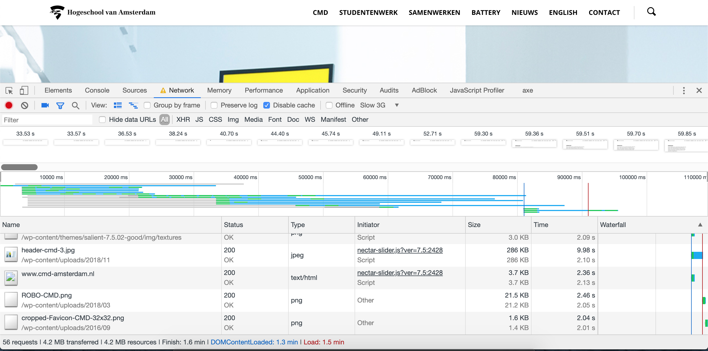
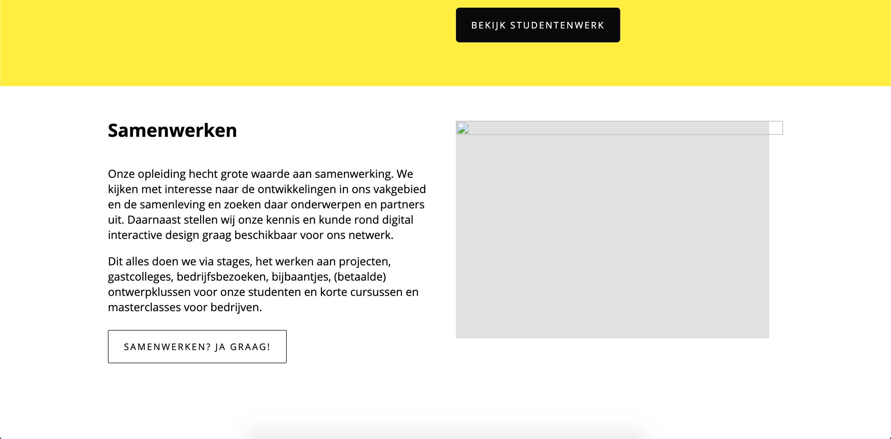

# Project 2 @cmda-minor-web-dev · 2018-2019
[Demo](https://cmda.herokuapp.com/)

## Opdracht
Verbeter de website van [CMD Amsterdam](https://www.cmd-amsterdam.nl/). Dit kan door bijvoorbeeld de Performance (Laadsnelheid) en Accessibility (toegankelijkheid) te verbeteren.
Ook kan er rekening gehouden worden met Progressive Enhancement. 

## Developer (install)
```
npm i
npm start
```

## Analyse 
#### Performance
Bij het draaien van een test van de website valt gelijk op dat de website zeer laag scoort op Performance.
Op traag 3G netwerk duurt het 1.5 minuut voordat de website geheel geladen is. <br/>
__Wat veroorzaakt deze trage laadtijd?__ (Kort door de bocht):
* HTML laadtijd 6.2 seconden
* CSS laadtijd 2.6 seconden
* __Afbeeldingen 40 - 50 seconden!__

##### Test


#### Accessibility
Wat betreft de toegankelijkheid van de website is dit vrijwel in orde. Er kunnen wel labels worden toegevoegd
zodat screenreaders de pagina beter kunnen begrijpen. 

## Uitwerking
Voor dit project heb ik me gefocust op de performance omdat hier het meest te verbeteren valt.
Wat betreft de performance zijn de afbeeldingen de hoofdoorzaak van de langzame laadtijd. Hier
heb ik me dus op gefocust. Omdat de gehele website nabouwen in één week een beetje te veel werk is heb ik 
ervoor gekozen om alleen de Homepage na te bouwen en te verbeteren. 

### Stap 1 - Server side 
Aangezien het een wordpress website is en deze op php draaien is het natuurlijk al een server side website.
Toch heb ik de website op mijn eigen NodeJS server laten draaien, zodat ik de performance verbeteringen kan 
toepassen die ik in het vak 'Performance-Matters' aan bod zijn gekomen. 

#### Wordpress API
Voor het renderen van de website waren er deze week twee keuzes:
* Gebruik de Wordpress REST API om de html (van de live website) per pagina op te halen en deze te renderen op de NodeJS server.
* Aangezien de HTML die uit de API komt niet helemaal schone HTML is leverde dit wat problemen op met het renderen van de HTML.
Daarom hebben sommigen ervoor gekozen om de website met eigen HTML na te maken.

Ik heb ervoor gekozen om de Wordpress API te gebruiken. Zo hoeft de klant zelf niks te veranderen aan zijn huidige werkwijze
binnen de Wordpress omgeving.

### Stap 2 - Styling
Aangezien de originele stylesheet die wordt ingeladen ruim 700kb is en ruim 20.000 regels aan CSS bevat, heb ik besloten om een nieuw
CSS bestand in te laden. Met "maar 300" regels CSS bereik ik hetzelfde resultaat met het laden van de Homepage.
Voor de positionering van de elementen op de pagina heb ik CSS-Grid gebruikt. Hier had ik nog niet eerder mee gewerkt. Maar
zeker voor websites uit een CMS is Grid een goeie techniek. Aangezien de elementen uit een CMS vaak onder elkaar gerendert worden
, dus zonder wrapper elementen. Met grid heb je geen wrappers nodig om de elementen bijvoorbeeld naast elkaar te positioneren.

### Stap 3 - Afbeeldingen
De oorzaak van de langzame laadtijd van de afbeeldingen wordt veroorzaakt door twee dingen:
* De afbeeldingen zijn te groot. Dit is onnodig, aangezien ze op de website uiteindelijk een vrij klein formaat hebben. 
* De afbeeldingen worden vanuit Wordpress ingeladen met een URL VB:("https://www.cmd-amsterdam.nl/wp-content/uploads/2018/11/cmd_daantjebons_0007.jpg").
Wanneer de afbeeldingen vanuit de NodeJS server lokaal geserveert zouden worden zal dit de laadtijd verbeteren. 

De afbeeldingen heb ik op de NodeJS server opgeslagen. Met behulp van NPM-scripts compress ik alle afbeeldingen en worden 
de afbeeldingen gekopieerd naar .webp Dit gebeurt hier:
```javascript
const imagemin = require('imagemin');
const imageminJpegtran = require('imagemin-jpegtran');

const webp = require("imagemin-webp");

imagemin(['public/img/*.jpg', 'public/img/*.png'], "public/img", {
    use: [
        webp({
            quality: 75
        })
    ]
});


(async () => {
    const files = await imagemin(['public/img/*.{jpg,png}'], 'public/img', {
        plugins: [
            imageminJpegtran({quality: 35})
        ]
    }).then(function() {
        console.log("Images converted!");
    });

})();
```
Nu de afbeeldingen "geminified" worden is de laadtijd al enigszins verbeterd. Ik heb er nog een schep bovenop gedaan door 
de afbeeldingen als webp formaat te tonen met een jpg of png als fallback. Zodat ze op andere browsers naast Chrome ook 
worden ingeladen. 

Aangezien ik de Html inlaad via de Wordpress API heb ik met server-side Javascript de ``src`` van de afbeeldingen weggehaald.
Deze voeg ik met Client-side Javascript weer in met mijn eigen compresste webp images. 

### Stap 4 - Service-worker
Met behulp van de service-worker is het mogelijk om de website te kunnen tonen ookal heeft de gebruiker geen internet.
Omdat de service worker de website opslaat op het apparaat van de gebruiker wil ik niet te veel onnodige bestanden opslaan.
Dus heb ik ervoor gekozen om alleen de Html en CSS te serveren als de gebuiker geen internet heeft. 

Dit is het resultaat:


Het overbrengen van informatie is het belangrijkste doel van de website. Hier zijn geen afbeeldingen voor nodig. Dus heb ik
deze weggelaten op de offline website. 

## Advies
* Serveer de website vanuit een NodeJS server
* Gebruik de Wordpress API om de bestaande pagina's vanuit Wordpress op te halen.
* Verklein de afbeeldingen en gebruik het webp formaat.
* Gebruik een service-worker zodat de gebruikers ook wanneer ze offline zijn de website nog kunnen gebruiken. 


